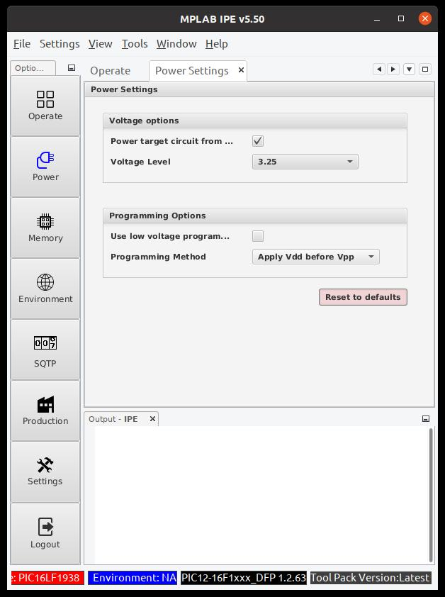
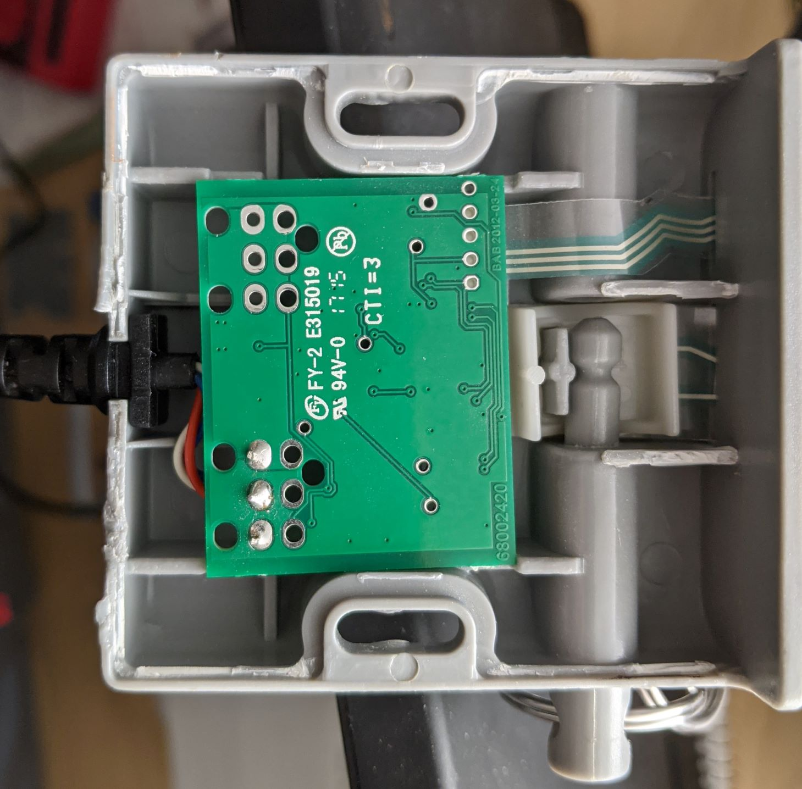
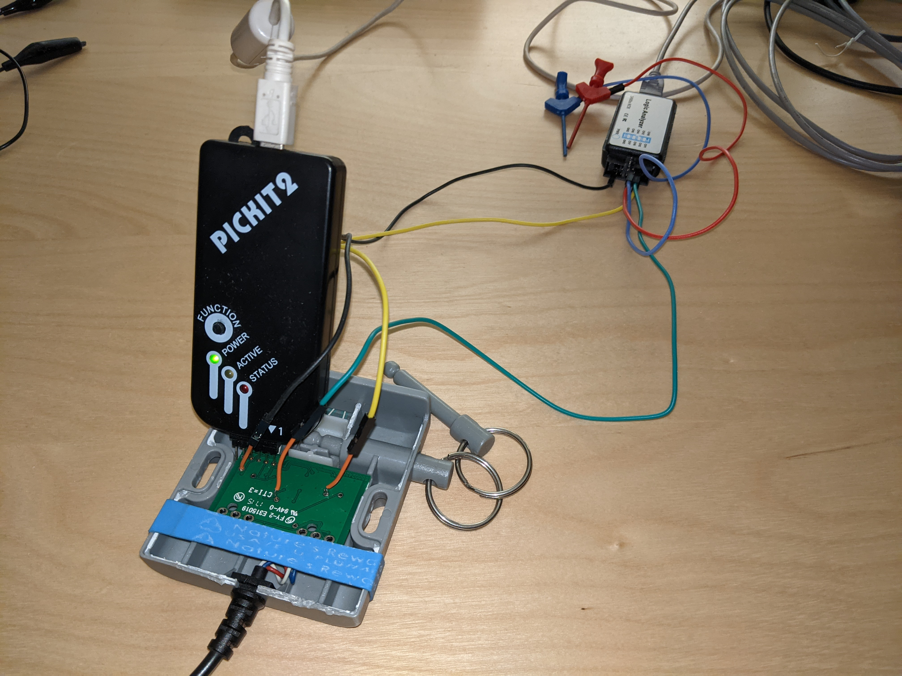
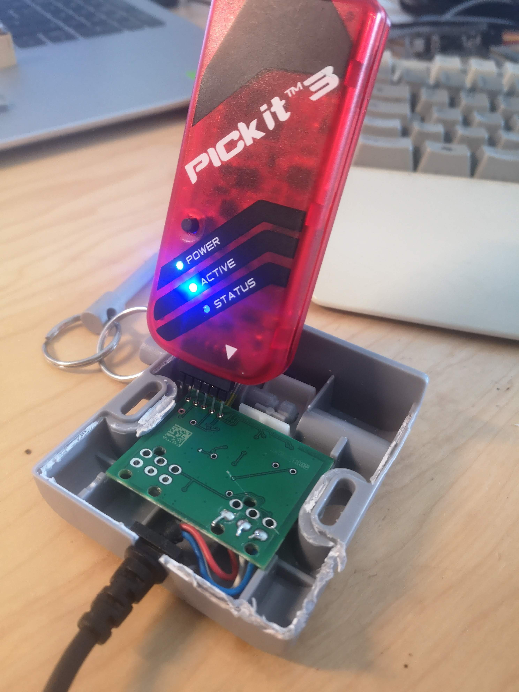
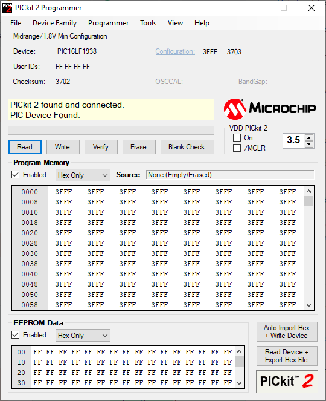
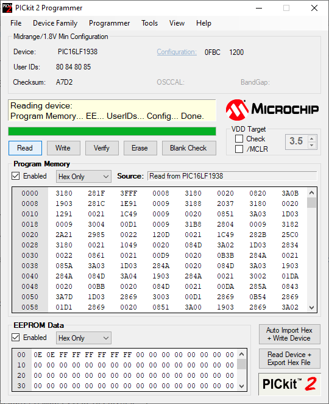
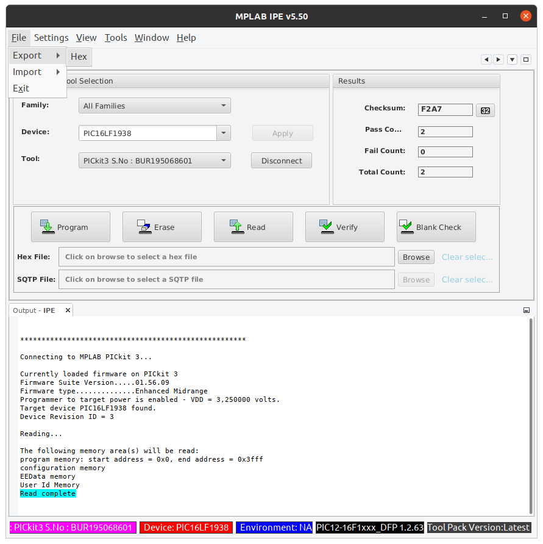
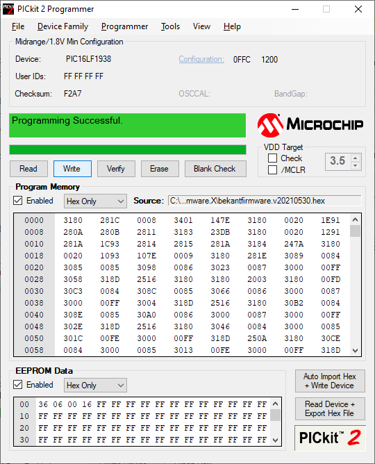
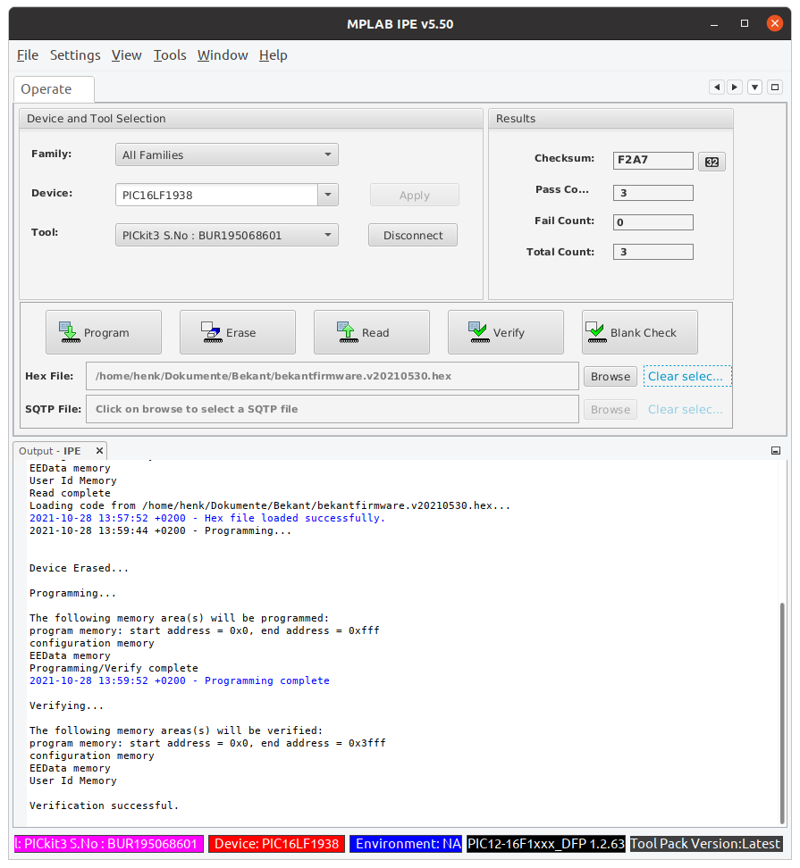

# Firmware Programming Guide

## Materials

1. BEKANT control box with physical access to the ICSP pins
2. PIC programmer hardware. PICkit 2 or PICkit3 work.
3. PIC programmer software.
   - PICkit2 or MPLAB IPE for Windows (PICkit2)
   - pk2cmd Command Line Linux or Windows (PICkit2)
   - MPLAB IPE on Linux (PICkit3)
4. Firmware image .hex file downloaded from [releases page](https://github.com/ivanwick/bekantfirmware/releases/). We will dump a backup of the OEM firmware before flashing the new firmware.

### Note about the PICkit 2

I just happened to have a PICkit 2 handy when I started working with this firmware. It will work great to dump and flash this chip, but it is [no longer supported by Microchip](https://www.microchip.com/en-us/development-tool/PG164120). PICkit 2 software is reliable but not actively developed. If you plan to do any further work on PIC microcontrollers, consider getting a newer PICkit which will have better support for in-circuit debugging from the IDE.

### Note about the PICkit 3

You will have to enable the power supply in the MPLAB IPE:

- Settings -> Advanced Mode -> Password "microchip"
- Power -> Select "Power target circuit from ..."



While you are in the Advanced mode enable the Hex Export function:

- Production -> Select "Allow Export Hex"

Then Logout logout from the Advanced Mode

## Method

### ICSP pin connection

ICSP stands for In-Circuit Serial Programming, which means we will be programming the microcontroller without removing it from the circuitboard.

To be safe, unplug the control box from the desk legs. The PICkit programmer will provide power while we dump and flash the microcontroller.

ICSP pins are accessible from the back of the board.



5 wires/pins must be connected between the board and the programmer.


Spacing of these holes is standard pitch that matches the PICkit pins. I was able to connect without any soldering by plugging a long pin header into the programmer and leaning it inside the holes enough to make contact.

PICkit2 | PICkit3
--- | ---
 | 

### Verifying connection

#### PICkit2 Programmer

PICkit software reads the microcontroller device ID when it is connected. It should report that it detected the PIC16LF1938. If not, adjust the connection and rescan by selecting menu Tools → Check Communication.



#### Command Line
```console
$ pk2cmd -P -I
Auto-Detect: Found part PIC16LF1938.

Device ID = 24A0
Revision  = 0003
Device Name = PIC16LF1938

Operation Succeeded
```

#### MPLAB IPE 

- Device -> Select "PIC16LF1938" -> Apply
- Connect
- Acknowledge the waring message


### Dump Firmware Backup 

#### PICKit2 Programmer

Enable both Program Memory and EEPROM Data, and click the Read button. This will dump the current contents of the microcontroller which you can save to a file. Select menu File → Export Hex.



You can write your saved OEM dump back to the device to "factory reset" the firmware.

#### Command Line
```console
$ pk2cmd -PPIC16LF1938 -GF oem_backup.hex
Read successfully.

Operation Succeeded
```

#### MPLAB IPE 

- Klick on Read
- After it shows "Read complete" -> File -> Export -> Hex -> Save it
  

### Write New Firmware

#### PICKit2 Programmer

Select menu File → Import Hex, and open the .hex file you downloaded from the releases page.



Enable both Program Memory and EEPROM Data, and click the Write button. Afterward, you can also click Verify to check that the write was successful.

#### Command Line
```console
$ pk2cmd -PPIC16LF1938 -F bekantfirmware.v20210530.hex -M
PICkit 2 Program Report
30-7-2021, 16:55:57
Device Type: PIC16LF1938

Program Succeeded.

Operation Succeeded

$ pk2cmd -PPIC16LF1938 -F bekantfirmware.v20210530.hex -Y
PICkit 2 Verify Report
30-7-2021, 16:56:28
Device Type: PIC16LF1938

Verify Succeeded.

Operation Succeeded
```

#### MPLAB IPE 

- Klick on Browse for "Hex file" and select the .hex file you downloaded from the releases page
- Klick on "Program"
- Klick on "Verify"


### Test New Firmware

To be safe, clear the path of the desk and be ready to cut power to the desk.
Plug the BEKANT control box back into the desk legs. With no input, the desk shoud not move.
You might have to powercycle the whole desk.

Try the OEM control gestures:
- Hold <kbd>△</kbd> to move up, release to stop
- Hold <kbd>▽</kbd> to move down, release to stop

Try new position memory gestures:
- <kbd>△</kbd> + <kbd>▽</kbd>, then release to move to upper position (default about 110cm)
- <kbd>▽</kbd> + <kbd>△</kbd>, then release to move to lower position (default about 70cm)

Personal adjustment and save
- Move the desk to your preferred sitting or standing position. Press simultaneously <kbd>△</kbd><kbd>▽</kbd> and hold for at least 3 seconds.
- To test, move out of position and then use a position memory gesture to move to the saved position.

## Be Careful

Use at your own risk.

Always ensure that the path of the desk is clear when you move it.
